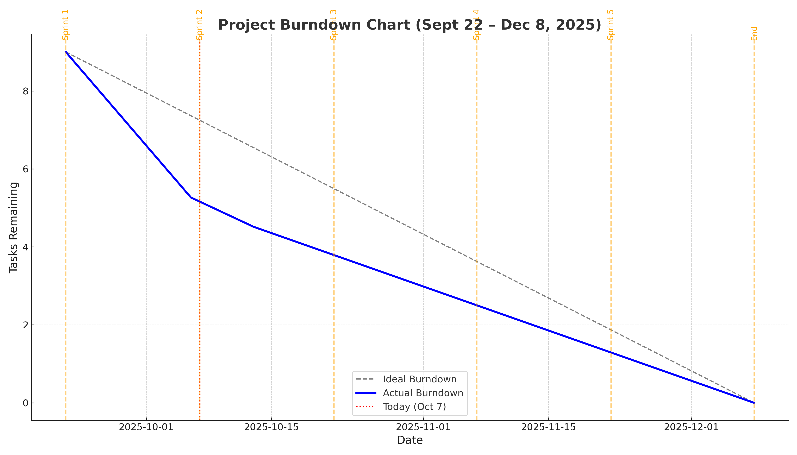

# Sprint 9/24/25 - 10/7/25
## Scrum Roles

| Team Member | Role             |
|-------------|------------------|
| Sam         | Scrum Master     | 
| John        | Product Owner    | 
| Simon       | Team Member      |
| Jacob       | Team Member      | 

## Sprint Meeting Schedule

| Meeting Type           | Date       | Summary |
|------------------------|------------|---------|
| **Sprint Planning**    | 09/24/2025 | All team members are to install Unity. Established basic understanding of Stratego and project scope. |
| **Daily Scrum #1**     | 9/25/2025 | Installation of Unity (same versions) on everyone's devices. Discussed sprint goals and expectations. |
| **Daily Scrum #2**     | 09/30/2025 | Assigned roles. Discussed who would lead on Unity, scripting, UI, and documentation. Also confirmed GitHub setup. |
| **Daily Scrum #3**     | 10/1/2025 | (Mid - Sprint Check In) Focused on creating and agreeing on game rules. Reviewed traditional Stratego mechanics and decided which features to implement first. |
| **Daily Scrum #4**     | 10/2/2025 | Review progress on Unity setup and basic board structure. Assign next development steps. |
| **Daily Scrum #5**     | 10/7/2025 | Evaluate backlog status. Identify adjustments to be made. Merging of assets and code. |
| **Sprint Retrospective**| 10/07/2025 | Reflect on the sprint. Identify positives, issues, and further actions for Sprint 2. |

## 📦 Product Backlog (After Sprint Planning)
Here’s our full product backlog as of 09/24/2025. Items are prioritized roughly top to bottom.
1. Establishment of basic rules for the game
2. Creation of the Starting Screen
3. Visuals for the game pieces
4. Sound effects for the game
5. 10x10 Gameboard
6. Initialization of pieces
7. Movement
8. Server and Client Handling with Revealing Pieces
9.  Gameplay
10. Win Condition
11. Online Multiplayer

## 🎯 Sprint Goal (Post Sprint Planning Meeting )
> “Establish the foundation of the Stratego game by completing environment setup, finalizing gameplay rules, assigning roles, and starting the core Unity project with a basic board layout.”

## Sprint Backlog (Post Sprint Planning Meeting )
Tasks we committed to for **Sprint 1**:
- [ ] Install Unity
- [ ] Set up GitHub and repo structure
- [ ] Assign Scrum roles
- [ ] Basic Stratego Rules
- [ ] Create Unity project
- [ ] Starting screen with options for Singleplayer, Multiplayer, etc.
- [ ] Create placeholder game pieces (visuals only)
- [ ] Some sound effects for the game
- [ ] Set up 10x10 board in Unity
- [ ] Start defining basic player input structure

## Sprint Backlog (Mid-Sprint)
- [x] Install Unity
- [x] Set up GitHub and repo structure
- [x] Assign Scrum roles
- [x] Basic Stratego Rules
- [x] Create Unity project
- [ ] Starting screen with options for Singleplayer, Multiplayer, etc.
- [ ] Create placeholder game pieces (visuals only)
- [ ] Some sound effects for the game
- [ ] Set up 10x10 board in Unity
- [ ] Start defining basic player input structure

## Product Backlog (End of Sprint)
1. Establishment of basic rules for the game (Done)
2. Creation of the Starting Screen (Done)
3. Visuals for the game pieces (In-progress)
4. Sound effects for the game (Done)
5. 10x10 Gameboard (Done)
6. Initialization of pieces
7. Movement
8. Server and Client Handling with Revealing Pieces
9.  Gameplay
10. Win Condition
11. Online Multiplayer
    
## Sprint Backlog (End of Sprint)
- [x] Install Unity
- [x] Set up GitHub and repo structure
- [x] Assign Scrum roles
- [x] Basic Stratego Rules
- [x] Create Unity project
- [x] Starting screen with options for Singleplayer, Multiplayer, etc
- [ ] Create placeholder game pieces (visuals only) (in-progress)
- [x] Some sound effects for the game
- [x] Set up 10x10 board in Unity
- [ ] Start defining basic player input structure (in-progress)

## Sprint Retrospective
### What Went Well
All team members installed the same Unity version where regardless of security warning issues, we avoid any compatibility issues.

GitHub repository was established early, ensuring smooth collaboration and version control throughout the sprint.

Clear role assignments where everyone had defined responsibilities, reducing confusion and overlap.

Progress on key visual elements: created the starting screen, added sound effects, and 10x10 gameboard. Sprites are almost done, which is great, as the next stage which would be sprite animations would come pretty soon.

There was solid team communication where the regular meetings helped us stay on track and identify problems early.

### What Could Have Gone Better
As it was the first sprint, it took a while to get everyone's systems to work with the right setups. 

There was a lack of understanding of scrum in the beginning of the sprint, making it hard to view what needed to be delivered.

### What to Improve for Next Sprint
Certain tasks like “player input” should be divided into smaller, manageable chunks (e.g. select pieces, validation of moves for certain pieces).

We should take note of tasks and their time complexities when looking at the sprints' capacities.

### Closing Statement
Overall, Sprint 1 laid a solid foundation for development. While there were a few startup challenges, the team adapted quickly and is better positioned for the next sprint.