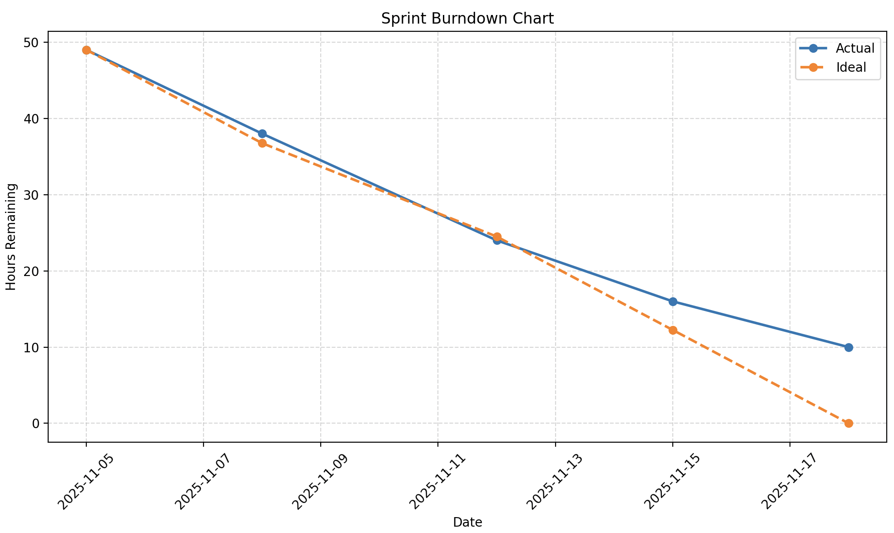

# Sprint 11/5/25 - 11/18/25

## Scrum Roles

| Team Member | Role             |
|-------------|------------------|
| Sam         | Team Member      | 
| John        | Team Member      | 
| Simon       | Product Owner    |
| Jacob       | Scrum Master     | 

## Sprint Meeting Schedule
| Meeting Type           | Date       | Summary |
|------------------------|------------|---------|
| **Sprint Planning**    | 11/5/2025 | Plan and estimate on things left that needed to be done, along with objective. |
| **Daily Scrum #1**     | 11/6/2025 | Quick review of roles and what needed to be done next |
| **Daily Scrum #2**     | 11/11/2025 | Bug fixes addressed from previous sprint |
| **Daily Scrum #3**     | 11/12/2025 | Review of things done |
| **Daily Scrum #4**     | 11/13/2025 | Assets and Art Organizing |
| **Daily Scrum #5**     | 11/18/2025 | Update on the given progress |
| **Sprint Retrospective**| 11/18/2025 | Reflect on the sprint. Wrapping things up and deciding if further actions need to be done. |

## Product Backlog (Beginning of Sprint 11/5/25)
Some particular order to the vision of the product as well as order of how we went about things

| #  | Feature                                          | Hours (0 means Done) | Notes |
|----|--------------------------------------------------|----------------------|-------|
| 1  | Establishment of basic rules for the game        | 0 (100%)  | Complete basic set of rules |
| 2  | Creation of the Starting Screen                  | 0 (100%)  | Complete Starting Screen |
| 2.1  | Decorating of the Starting Screen              | 5 (In-progress)   | Background visual for Starting Screen |
| 3  | Visuals for the game pieces                      | 0         | Complete sprite of pieces |
| 4  | Sound effects for the game                       | 0         | Sound effects added, Will need Some More Integration|
| 5.1 | 10x10 Gameboard                                 | 0         | GameBoard Setup Done  |
| 5.2  | 10x10 Gameboard  External Decor                | 2 (In-progress)        | Decorative Element that the Board is Placed on |
| 6.1 | Initialization of pieces                        | 10        | Current - Can create the piece but can't create when playing |
| 7.1 | Roles of General Pieces                         | 0         | Roles of General Pieces Done |
| 7.2 | Special Roles                                   | 0         | Roles Establishes |
| 8.1  | Movement                                       | 0         | Complete General Movement of All Pieces |
| 8.2  | Special - Movement                             | 0         | Complete Movement for Special Roles |
| 9.1 | General Combat                                  | 2         | Few clicking Bug Problems |
| 9.2  | Special Effects Specific Piece Role in Combat  | 0         | Additional Powers/Restrictions for Specific Pieces in Combat |
| 10  | Turn Handling with Revealing Pieces             | 2         | When It's Player 1's Turn, can't see rest of Player 2 pieces (Bug Handling) |
| 11 | Gameplay Polishing                               | XX        | General Bug Fixes within Game |
| 12 | Win Condition                                    | 1         | Bug Fix - Condition to Win the Game |
| 13 | Game Over UI                                     | 3         | Flag Win Condition Complete, Movable Pieces Win Condition to be Implemented |
| 14 | Game Over Stats                              | 2       | Gives an Overview on who won, how many pieces each team took, and how the teams won |

## Sprint Backlog (start)
### Sprint Goal: To Fix Ongoing Bugs, and Polishing the Overall Gameplay Experience for Players that Are to Play the Game

| #  | Feature                                          | Hours (0 means Done) | Notes |  Owner |
|----|--------------------------------------------------|----------------------|-------| -------|
| Special | Polishing Gameplay and Fixing Bugs  | XX (See #11)  | There are multiple parts to this instance to highlight what actions were taken |
| 2.1  | Decorating of the Starting Screen              | 5 (In-progress)   | Background visual for Starting Screen |
| 5.2  | 10x10 Gameboard  External Decor (Cam Background Sprites)  | 2 (In-progress)        | Decorative Element that the Board is Placed on |
| 6.1 | Initialization of pieces                        | 10        | Current - Can create the piece but can't create when playing |
| 9.1 | General Combat                                  | 2         | Few clicking Bug Problems |
| 9.1.1 | General Combat (Bug)                          | 2         | Turn Transition After Attack |
| 11 | Gameplay Polishing (Includes some Bug Fixes)     | (Total: 20) (See 11.1-11.4)   | Needing Sprites, Better Transition, Enhancing Gameplay Experience for Players and Combining the Necessary Things|
| 11.1.1 | Title Screen Revamp + Sprites                | 5        | Needing to Attach the Necessary Sprites Better Visuals |
| 11.1.2 | Applying Mouseclick sounds                   | 2        | Finish Applying Necessary Mouse Click Sounds |
| 11.2.1 | Collision Bugs and Box Collider              | 5        | Fix Collision Bugs and General Collision |
| 11.2.2 | Remake All Prefabs                           | 5        | Fixing the Layers |
| 11.3.1 | Game Over Stats Polishing                    | 2        | Makes the GameOver UI Look Better |
| 11.4   | Miscellaneous Sprites                        | 1        | Miscellaneous Sprites for Usage |
| 12 | Win Condition                                    | 1         | Bug Fix - Condition to Win the Game |
| 13 | Game Over UI                                     | 2         | Flag Win Condition Complete, Movable Pieces Win Condition to be Implemented |
| 14 | Game Over Stats                              | 3       | Gives an Overview on who won, how many pieces each team took, and how the teams won |
| 15 | Fix Executables to Run After All Changes in Current Sprint are Made | 2       | Updating necessary things for executable and README if needed |

## Sprint Backlog (mid-Sprint 11/12/25)

| #  | Feature                                          | Hours (0 means Done) | Notes |  Owner |
|----|--------------------------------------------------|----------------------|-------| -------|
| Special | Polishing Gameplay and Fixing Bugs  | (See #11)  | There are multiple parts to this instance to highlight what actions were taken |
| 2.1  | Decorating of the Starting Screen              | 0   | Background visual for Starting Screen | Sam
| 5.2  | 10x10 Gameboard  External Decor (Cam Background Sprites)  | 2 (In-progress)        | Decorative Element that the Board is Placed on | Sam
| 6.1 | Initialization of pieces                        | 10        | Current - Can create the piece but can't create when playing |
| 9.1 | General Combat                                  | 2         | Few clicking Bug Problems | John
| 9.1.1 | General Combat (Bug)                          | 0         | Turn Transition After Attack | Simon
| 11 | Gameplay Polishing (Includes some Bug Fixes)     | (Total: 8)(See 11.1-11.4)    | Needing Sprites, Better Transition, Enhancing Gameplay Experience for Players and Combining the Necessary Things| Sam, Simon, Jacob, John
| 11.1.1 | Title Screen Revamp + Sprites                | 0        | Needing to Attach the Necessary Sprites Better Visuals | Jacob
| 11.1.2 | Applying Mouseclick sounds                   | 2        | Finish Applying Necessary Mouse Click Sounds | Jacob
| 11.2.1 | Collision Bugs and Box Collider              | 3        | Fix Collision Bugs and General Collision | John
| 11.2.2 | Remake All Prefabs                           | 0        | Fixing the Layers, Backgrounds and Pieces | John
| 11.3.1 | Game Over Stats Polishing                    | 2        | Makes the GameOver UI Look Better | Jacob, Simon
| 11.4   | Miscellaneous Sprites                        | 1        | Miscellaneous Sprites for Usage | Sam
| 12 | Win Condition                                    | 0         | Conditions to Win the Game Complete | Simon
| 13 | Game Over UI                                     | 0         | Flag Win Condition Complete, Movable Pieces Win Condition to be Implemented | Simon
| 14 | Game Over Stats                                  | 0         | In addition to who won, gives an Overview how many pieces each team took, and how the teams won | Simon
| 15 | Fix Executables to Run After All Changes in Current Sprint are Made | 2       | Updating necessary things for executable and README if needed | John, Jacob

## Sprint Backlog (End of Sprint 11/18/25)

| #  | Feature                                          | Hours (0 means Done) | Notes |  Owner |
|----|--------------------------------------------------|----------------------|-------| -------|
| Special | Polishing Gameplay and Fixing Bugs  | (See #11)  | There are multiple parts to this instance to highlight what actions were taken |
| 2.1  | Decorating of the Starting Screen              | 0                    | Background visual for Starting Screen | Sam
| 5.2  | 10x10 Gameboard  External Decor (Cam Background Sprites)  | 0         | Decorative Element that the Board is Placed on | Sam
| 6.1 | Initialization of pieces                        | 10 (Not Done) | Current - Can create the piece but can't create when playing |
| 9.1 | General Combat                                  | 0         | Few clicking Bug Problems | John
| 9.1.1 | General Combat (Bug)                          | 0         | Turn Transition After Attack | Simon
| 11 | Gameplay Polishing (Includes some Bug Fixes)     | (Total: 0)(See 11.1-11.4)    | Needing Sprites, Better Transition, Enhancing Gameplay Experience for Players and Combining the Necessary Things| Sam, Simon, Jacob, John
| 11.1.1 | Title Screen Revamp + Sprites                | 0        | Necessary Sprites Better Visuals Done | Jacob
| 11.1.2 | Applying Mouseclick sounds                   | 0        | Finished Necessary Mouse Click Sounds | Jacob
| 11.2.1 | Collision Bugs and Box Collider              | 0        | Fix Collision Bugs and General Collision | John
| 11.2.2 | Remake All Prefabs                           | 0        | Fixed Layers, Backgrounds and Pieces | John
| 11.3.1 | Game Over Stats Polishing                    | 0        | Makes the GameOver UI Look Better | Jacob, Simon
| 11.4   | Miscellaneous Sprites                        | 0        | Miscellaneous Sprites for Usage | Sam
| 11.5 | Fix Executables to Run After All Changes in Current Sprint are Made | 0       | Executable | John, Jacob
| 12 | Win Condition                                    | 0         | Conditions to Win the Game Complete | Simon
| 13 | Game Over UI                                     | 0         | Flag Win Condition Complete, Movable Pieces Win Condition to be Implemented | Simon
| 14 | Game Over Stats                                  | 0         | In addition to who won, gives an Overview how many pieces each team took, and how the teams won | Simon
| 15 | Fix Executables to Run After All Changes in Current Sprint are Made | 0      | Executables | John, Jacob

## Product Backlog (End of Sprint 11/18/25)

| #  | Feature                                          | Hours (0 means Done) | Notes |
|----|--------------------------------------------------|----------------------|-------|
| 1  | Establishment of basic rules for the game        | 0   | Complete basic set of rules |
| 2  | Creation of the Starting Screen                  | 0   | Complete Starting Screen |
| 2.1  | Decorating of the Starting Screen              | 0   | Background visual for Starting Screen |
| 3  | Visuals for the game pieces                      | 0         | Complete sprite of pieces |
| 4  | Sound effects for the game                       | 0         | Sound effects added, Will need Some More Integration|
| 5.1 | 10x10 Gameboard                                 | 0         | GameBoard Setup Done  |
| 5.2  | 10x10 Gameboard  External Decor                | 0         | Decorative Element that the Board is Placed on |
| 6.1 | Initialization of pieces (Piece Placement Stage)| 10        | Current - Can create the piece but can't create when playing |
| 7.1 | Roles of General Pieces                         | 0         | Roles of General Pieces Done |
| 7.2 | Special Roles                                   | 0         | Roles Established |
| 8.1  | Movement                                       | 0         | Complete General Movement of All Pieces |
| 8.2  | Special - Movement                             | 0         | Complete Movement for Special Roles |
| 9.1 | General Combat                                  | 0         | Combat Mechanics Done |
| 9.2  | Special Effects Specific Piece Role in Combat  | 0         | Additional Powers/Restrictions for Specific Pieces in Combat |
| 10  | Turn Handling with Revealing Pieces             | 0         | When It's Player 1's Turn, can't see rest of Player 2 pieces (Bug Handling) |
| 11 | Gameplay Polishing                               | 0         | General Bug Fixes within Game |
| 12 | Win Condition                                    | 0         | Bug Fix - Condition to Win the Game |
| 13 | Game Over UI                                     | 0         | Flag Win Condition Complete, Movable Pieces Win Condition to be Implemented |
| 14 | Game Over Stats                                  | 0         | Gives an Overview on who won, how many pieces each team took, and how the teams won |
| 15 | Updating Executable                              | 0         | Executable for players to play |

## Burndown Chart

## Sprint Retrospective
### What Went Well
Significant Bug Fixes Completed

All major gameplay bugs—including combat, collision, prefab issues, and turn-handling—were resolved by the end of the sprint.
Turn transitions (especially after attacks) now behave correctly.
Sprites and Decor implemented, making the game much more enjoyable to look at.

Multiple tasks (e.g., gameplay polishing) were completed collaboratively.

Prefabs corrected, layers fixed, and visuals unified.
Excess time allocated allowed for necessary things to be thoroughly polished.

### What Could Be Improved
Sprint hours started at 49. - Because polishing required revisiting, some excess time was allocated to fall back on.
Additionally, Piece Initialization wasn't worked on within this sprint due to lack of time.
(Reflected in the Burndown Chart)

Some bugs that needed to be fixed first delayed few parts of polishing.

### What to Improve Next Sprint
Subtasks for Features - Because Piece Initialization before the Gameplay has a lot of parts, we should try to divide up the main feature into smaller managable parts.

### Key Learnings
Polishing Gameplay and visuals (including bug fixes) enhances the game experience for players. 
